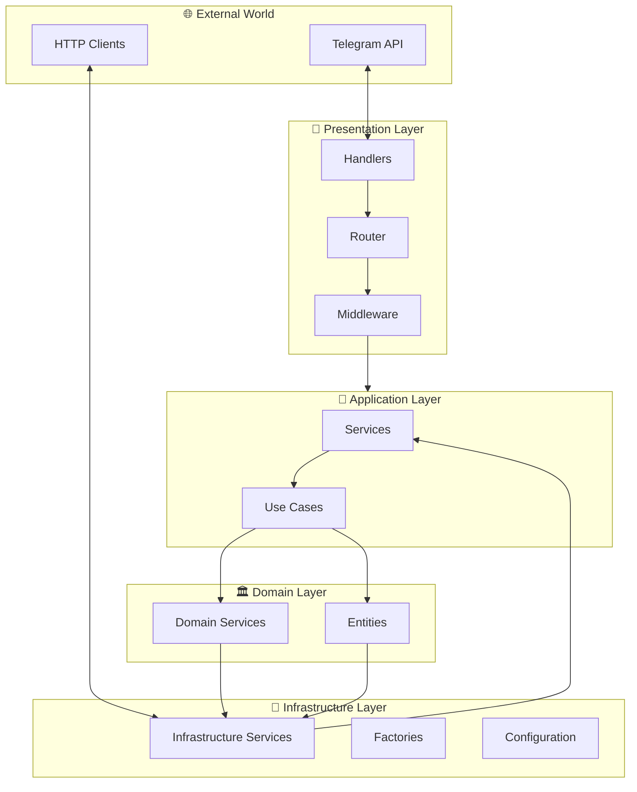

# Go Telegram Bot - Clean Architecture

## 🏗️ Kiến Trúc Tổng Quan

```mermaid
flowchart TD
    %% =============================
    %% External World
    %% =============================
    subgraph EXT["🌐 External World"]
        TELEGRAM_API["Telegram API"]
        HTTP_CLIENTS["HTTP Clients"]
    end

    %% =============================
    %% Presentation Layer
    %% =============================
    subgraph PRES["📡 Presentation Layer"]
        HANDLERS["Handlers"]
        MIDDLEWARE["Middleware"]
        ROUTER["Router"]
    end

    %% =============================
    %% Application Layer
    %% =============================
    subgraph APP["🎯 Application Layer"]
        SERVICES["Services"]
        USECASES["Use Cases"]
    end

    %% =============================
    %% Domain Layer
    %% =============================
    subgraph DOMAIN["🏛️ Domain Layer"]
        ENTITIES["Entities"]
        DOMAINSVCS["Domain Services"]
    end

    %% =============================
    %% Infrastructure Layer
    %% =============================
    subgraph INFRA["🔧 Infrastructure Layer"]
        INFRASVCS["Infrastructure Services"]
        FACTORIES["Factories"]
        CONFIG["Configuration"]
    end

    %% =============================
    %% Connections
    %% =============================
    TELEGRAM_API <--> HANDLERS
    HTTP_CLIENTS <--> INFRASVCS

    HANDLERS --> ROUTER
    ROUTER --> MIDDLEWARE
    MIDDLEWARE --> APP

    SERVICES --> USECASES
    USECASES --> ENTITIES
    USECASES --> DOMAINSVCS

    DOMAINSVCS --> INFRASVCS
    ENTITIES --> INFRASVCS
    INFRASVCS --> SERVICES
```
